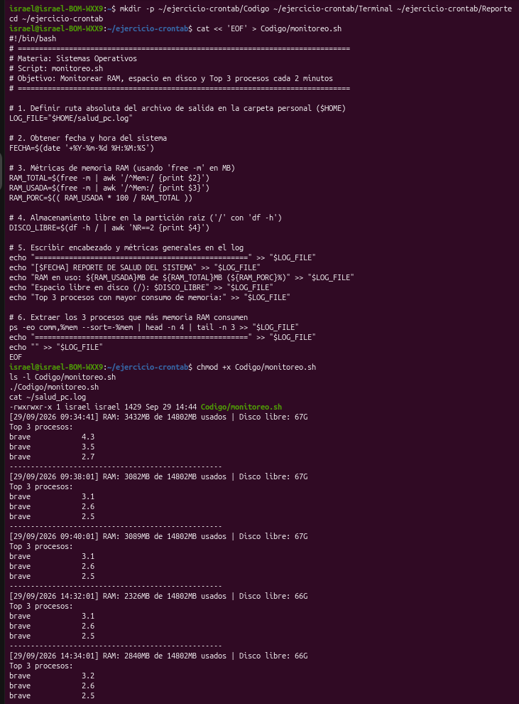
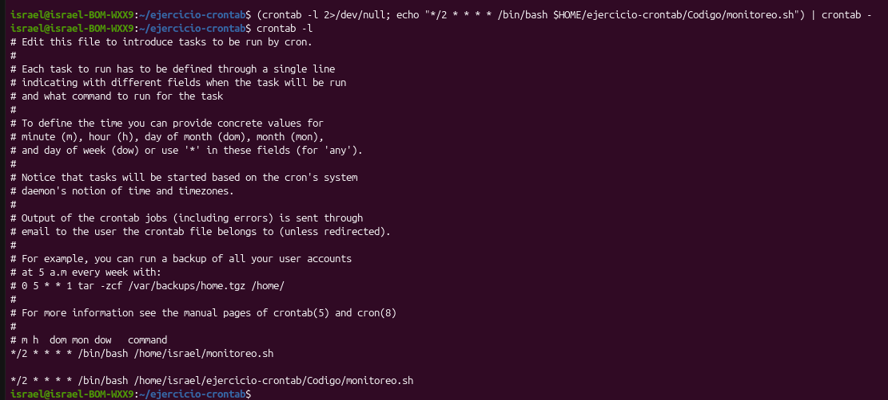
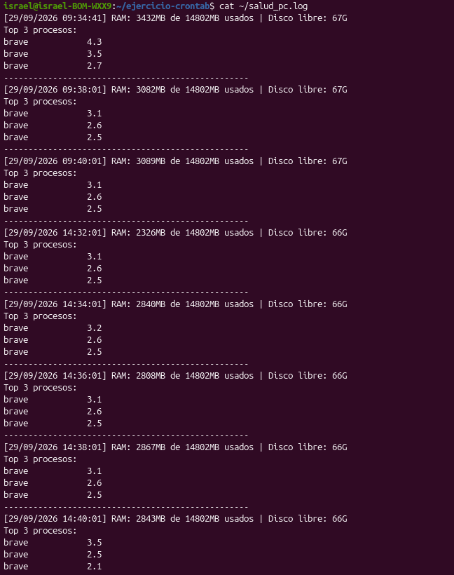
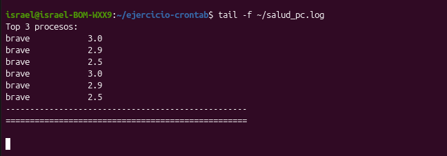

cat << 'EOF' > ~/ejercicio-crontab/README.md
# Monitoreo Automatizado de Salud del Sistema con Crontab

## 🎯 Objetivos
* Diseñar e implementar un script en Bash para monitorear el consumo de memoria RAM, espacio libre en disco y los procesos de mayor demanda.
* Automatizar la recolección periódica en segundo plano cada 2 minutos utilizando el programador de tareas `crontab`.
* Analizar el impacto de la concurrencia de aplicaciones pesadas en los recursos del sistema operativo.

---

## 📁 Jerarquía de Carpetas

* 📁 **[Codigo/](Codigo/)**: Script de automatización en Bash comentado y funcional.
* 📁 **[Terminal/](Terminal/)**: Capturas nítidas de la ejecución de comandos y verificación en vivo.
* 📁 **[Reporte/](Reporte/)**: Reporte formal en formato PDF con justificación teórica del sistema operativo.

---

## 🛠️ Explicación de Comandos y Herramientas

| Comando / Operador | Función Técnica en la Práctica |
| :--- | :--- |
| `date '+%Y-%m-%d %H:%M:%S'` | Genera marcas de tiempo exactas para el control cronológico de eventos. |
| `free -m` | Consulta la memoria física total y en uso provista por `/proc/meminfo` en megabytes. |
| `df -h /` | Inspecciona el espacio ocupado y disponible en el sistema de archivos raíz (`/`). |
| `awk` | Filtra campos específicos de la salida de texto para procesar los datos numéricos. |
| `ps -eo comm,%mem --sort=-%mem` | Lista los procesos activos ordenados de mayor a menor consumo de RAM. |
| `head -n 4 \| tail -n 3` | Delimita la visualización al Top 3 de procesos omitiendo los encabezados. |
| `>>` | Redirecciona la salida estándar en modo anexado (*append*) para no sobrescribir el log. |
| `crontab -e` / `crontab -l` | Permite editar y auditar la tabla de planificación de tareas en segundo plano. |

---

## 📸 Evidencias de la Terminal

|  |  |
| :---: | :---: |
| **1. Permisos y ejecución manual** | **2. Programación en Crontab** |
|  |  |
| **3. Registros periódicos en log** | **4. Monitoreo en vivo (`tail -f`)** |

---

## 📄 Reporte Formal

* 📎 [Descargar Reporte PDF](Reporte/Reporte_Salud_Sistema.pdf)

---

## 💻 Código y Scripts

* 📜 [monitoreo.sh](Codigo/monitoreo.sh)

---

## 🎥 Video del funcionamiento

* ▶️ [Ver video en YouTube](https://youtu.be/DPsYs6gwN64)

---

## 💡 Conclusiones Técnicas
* **Supervisión Continua:** El monitoreo automatizado permite identificar saturaciones de memoria provocadas por navegadores y herramientas de desarrollo antes de que afecten la estabilidad del sistema operativo.
* **Eficiencia de Crontab:** Delegar la periodicidad al planificador de tareas del sistema evita mantener scripts en bucles activos, optimizando ciclos de reloj y consumo de energía.
* **Comportamiento Multiproceso:** Se comprobó que aplicaciones como navegadores web fragmentan sus cargas en múltiples procesos concurrentes, demandando herramientas como `ps` para una auditoría precisa.
EOF
